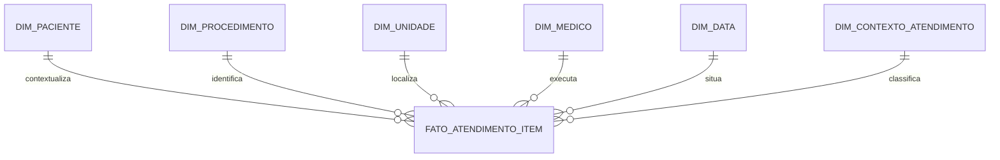

# Solução técnica

Solução dos quatro escopos do [PDF](../referencias/desafio_tecnico_analytics_engineering_candidato.pdf). **Partes 1 e 2 executadas no BigQuery pelo Dataform CLI e pelo serviço Dataform do GCP. Partes 3 e 4 documentadas como decisões e propostas**, conforme permitido pelo desafio. [Instruções de execução](EXECUCAO.md).

## 1. Modelo dimensional e catálogo

**Grão da fato:** um item de procedimento de um atendimento. Chave de negócio: `id_atendimento + id_item`. Os IDs permanecem para rastreabilidade; atendimento é uma dimensão degenerada, sem tabela própria.

| Tabela em `analytics` | Uma linha representa | Conteúdo principal |
| --- | --- | --- |
| `fato_atendimento_item` | Item no atendimento | Data/hora, seis SKs, bruto, desconto rateado e líquido. |
| `dim_paciente` | Versão do paciente | ID, nome, plano, cidade, início/fim da vigência e indicadores de versão atual/histórico desconhecido. |
| `dim_procedimento` | Código de procedimento | Código e nome. |
| `dim_unidade` | Unidade | Identificador disponível na origem. |
| `dim_medico` | Executante | Identificador disponível na origem. |
| `dim_data` | Dia | Data, ano, mês, dia e trimestre. |
| `dim_contexto_atendimento` | Tipo + status | Classificação do atendimento. |

**SK (Surrogate Key)** é a chave técnica da linha. Paciente usa ID + número da versão (`PAC_001_1`). Procedimento, Unidade e Médico recebem sequência por código; Contexto por tipo/status; Item por atendimento/item. Data usa AAAAMMDD. As colunas `sk_*` ligam a fato às dimensões.

**SCD Tipo 2 (Slowly Changing Dimension)** preserva mudanças em novas linhas:

1. Ordenar atualizações por paciente e data, eliminar duplicatas exatas e ignorar atualizações sem mudança.
2. Criar nova versão quando nome, plano ou cidade mudar.
3. Encerrar a anterior no início da seguinte: início inclusivo e fim exclusivo. A última tem fim aberto.
4. Associar o item à versão vigente na data do atendimento.

Exemplo: `PAC_001_1` guarda Unimed Premium de 10/01/2024 08:30 até antes de 15/06/2024 14:20; `PAC_001_2` guarda Bradesco Saúde Top a partir desse instante. [Referência Kimball](https://www.kimballgroup.com/data-warehouse-business-intelligence-resources/kimball-techniques/dimensional-modeling-techniques/type-2/).

**Histórico ausente:** dez atendimentos, com 20 itens de cinco pacientes, antecedem o primeiro cadastro. A versão `_0` preserva o ID, mantém atributos desconhecidos e termina no primeiro cadastro conhecido. Resultado: 18 versões, sendo 13 conhecidas e cinco desconhecidas.

**Premissas:** data do atendimento representa a do item; atualização cadastral aproxima vigência; horários sem fuso são interpretados como UTC. O plano cadastrado não comprova o plano faturado. A carga completa pode renumerar SKs se chegar histórico anterior; todas as tabelas são reconstruídas no fluxo. Incremental permanente exigiria persistir as SKs.

## 2. Transformação e qualidade

**Linhagem:** CSVs → `raw` em texto → `staging` com tipos → dimensões/fato → BI. As referências SQLX definem as dependências.

| Dataset principal | Papel no fluxo | Objetos |
| --- | --- | --- |
| `raw` | Preservar os CSVs que entram no Dataform | 3 tabelas de origem |
| `staging` | Converter tipos e preparar o histórico | 3 tabelas intermediárias |
| `analytics` | Disponibilizar o modelo para BI | 6 dimensões e 1 fato |
| `analytics_assertions` | Diagnosticar violações de qualidade | 24 views; zero linhas indica aprovação |

Os quatro datasets com sufixo `_repro` replicam o fluxo para teste isolado e não são consumidos pelo BI principal. Views de assertions são diagnósticos consultáveis, não logs permanentes de execução.

**Rateio:** desconto do atendimento × valor do item ÷ soma dos itens. O cálculo usa centavos inteiros; centavos restantes são distribuídos pelos maiores restos, com desempate pelo ID do item. Líquido do item = bruto − desconto rateado.

**Validações implementadas:** unicidade, campos não nulos/vazios, relacionamentos, nomes conflitantes de procedimento, continuidade da vigência, SK do paciente vigente no atendimento e reconciliação por atendimento. A amostra passou nas **24 assertions**, com dez tabelas criadas.

| Resultado da amostra | Valor |
| --- | --- |
| Atendimentos / itens | 60 / 155 |
| Bruto | R$ 41.285,00 |
| Desconto | R$ 2.767,25 |
| Líquido, todos os status | R$ 38.517,75 |
| Líquido, somente concluídos | R$ 32.421,25 |

Bruto, desconto e líquido do item são somáveis. Contar linhas mede itens; atendimentos e pacientes exigem contagem distinta da identidade de negócio. Todos os status são preservados e o indicador deve explicitar seu filtro. Líquido não comprova recebimento.

**Verificação:** a amostra reconciliou os valores e a associação temporal. Cenários sintéticos pontuais validaram centavos, desconto zero/integral, limites de vigência e atualização sem mudança; entradas inválidas foram detectadas. A reprodução ocorreu em datasets isolados no mesmo projeto.

**Limites conhecidos:** `MIN` ainda seleciona o nome do procedimento para o modelo, mas conflito na origem agora reprova a assertion. Os cenários sintéticos foram pontuais, sem suíte contínua. A carga completa não publica fato e dimensões em uma transação única; uma falha de assertion exige intervenção operacional antes de expor uma nova versão ao BI.

## 3. Performance, Cloud e FinOps

### BigQuery

Na amostra, manter fato e dimensões **sem partição ou clustering**: 155 itens não justificam ganho presumido. Consultas esperadas: período, unidade, procedimento e plano histórico.

| Objeto | Estratégia candidata com crescimento | Justificativa |
| --- | --- | --- |
| Fato | Partição mensal pela data do atendimento; diária se volume e filtros justificarem. | Eliminar períodos fora da consulta sem fragmentar volumes pequenos. |
| Fato | Clustering por `sk_unidade`, depois `sk_procedimento`. | Reduzir blocos lidos em filtros compatíveis com essas chaves. |
| Paciente | Sem partição; avaliar clustering por `id_paciente`. | Localizar versões sem excluir cadastros antigos ainda vigentes. |
| Demais dimensões | Sem organização adicional enquanto pequenas. | Evitar complexidade sem benefício medido. |

Exigir filtro temporal no cenário particionado, diretamente na fato. Não presumir poda apenas pelo JOIN com dimensões. A documentação indica benefício geralmente pequeno de clustering abaixo de 64 MB e sugere avaliar partições com média de 10 GB, como referências, não limites obrigatórios. [BigQuery](https://docs.cloud.google.com/bigquery/docs/clustered-tables).

**FinOps (gestão de uso/custo):** selecionar colunas necessárias, estimar leitura, limitar bytes faturáveis e acompanhar bytes, frequência e latência. Comparar consultas equivalentes sem cache antes de afirmar economia. Em cobrança por capacidade, monitorar slots. Alertas de orçamento não bloqueiam gastos. Nenhuma economia foi medida neste case. [Controle de custos](https://docs.cloud.google.com/bigquery/docs/best-practices-costs).

### Snowflake, alternativa proposta

Warehouse é o recurso de computação. Separar transformação e BI evita disputa direta e permite atribuir custos por carga.

| Configuração inicial de teste | Transformação | BI/diretoria |
| --- | --- | --- |
| Warehouse | `WH_TRANSFORMACAO` | `WH_BI` |
| Tamanho | Small; comparar com Medium em cargas pesadas | X-Small; ajustar à latência |
| Auto-suspend | 60 segundos ocioso | 300 segundos ocioso |
| Auto-resume | Ativado | Ativado |
| Clusters | Um | Um; testar mínimo 1/máximo 2 se houver fila |

Aumentar tamanho atende consultas pesadas; multi-cluster atende concorrência e requer Enterprise ou superior. Suspender perde cache local; warehouses padrão têm mínimo de 60 segundos cobrados por retomada. Ajustar usando créditos, fila e latência. Snowflake não foi implantado. [Dimensionamento](https://docs.snowflake.com/en/user-guide/warehouses-considerations).

## 4. CI/CD e governança

**CI** valida alterações; **CD** promove uma versão aprovada. Proposta para GitHub Actions, ainda não implantada:

1. Branch curta `feat/...` ou `fix/...`, com código, testes e catálogo na mesma pull request (PR).
2. `npm ci` e compilação. Compilar não substitui executar o SQL.
3. Executar todo o projeto em datasets por PR, dentro de projeto de testes, com identidade sem escrita em produção. Código externo exige revisão antes de receber credenciais.
4. Qualquer erro de tabela, assertion ou reconciliação bloqueia a PR. Exigir revisão e checks aprovados para merge em `main`.
5. Identificar a release pelo commit/tag, validar em homologação e promover somente a versão aprovada para o BI. Reter a versão anterior para retorno e remover datasets temporários após o uso.

**Escolha:** isolamento com execução completa, simples para dez tabelas. Slim CI seria uma evolução: comparar grafos de PR e `main`, selecionar alterações, dependentes e testes, com dependências não reconstruídas disponíveis em base validada. Mudanças globais exigem execução completa.

**Operação:** registrar commit, origem e resultado de cada carga. Falhas devem alertar o responsável e impedir promoção. A execução atual não oferece publicação atômica, rollback ou bloqueio automático de todas as tabelas por assertions. [Dependências Dataform](https://docs.cloud.google.com/dataform/docs/dependencies).

**Dataform gerenciado:** conexão HTTPS de leitura à branch pública `main`; o projeto compilou 37 nós (três declarações e 34 ações executáveis). A execução aprovou 34 ações. Alterações são feitas no GitHub/local e trazidas ao workspace por pull. CLI e serviço mantêm históricos separados.

**Catálogo:** a tabela da seção 1 registra grão e conteúdo; medidas e linhagem estão na seção 2. Responsável no case: autor da entrega. Atualização manual por reconstrução completa. Em produção, definir responsável nominal e prazo de atualização.

**Metadados versionados:** `includes/catalogo.json` centraliza descrições de datasets, tabelas, colunas e testes. Os SQLX usam esse catálogo para publicar descrições das saídas. Após a execução, `scripts/documentar_bigquery.py` completa origens e views de qualidade, descreve datasets e aplica labels de camada/ambiente. Sem `--apply`, verifica inventário e descrições. Marcar identidade como restrita no catálogo não implementa controle de acesso; IAM continua sendo uma configuração separada.

**Resultado verificado:** oito datasets, 74 objetos e 346 colunas descritos, sem divergências com o catálogo. O fluxo principal aprovou dez tabelas e 24 assertions; a fato manteve 155 itens, dos quais 20 têm histórico desconhecido. A comparação das fatos principal/reprodução não encontrou diferenças; o grafo principal não depende de `_repro`.

**Segurança e limites:** dados simulados; restringir nome/identidade também em raw e staging, usar acesso mínimo e credenciais fora do Git. SK derivada do ID não anonimiza. A restrição por coluna e a proteção de `main` não estão implantadas. A solução não está homologada para dados reais de produção.
